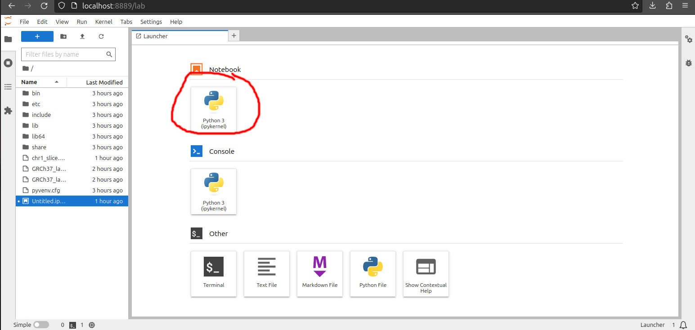
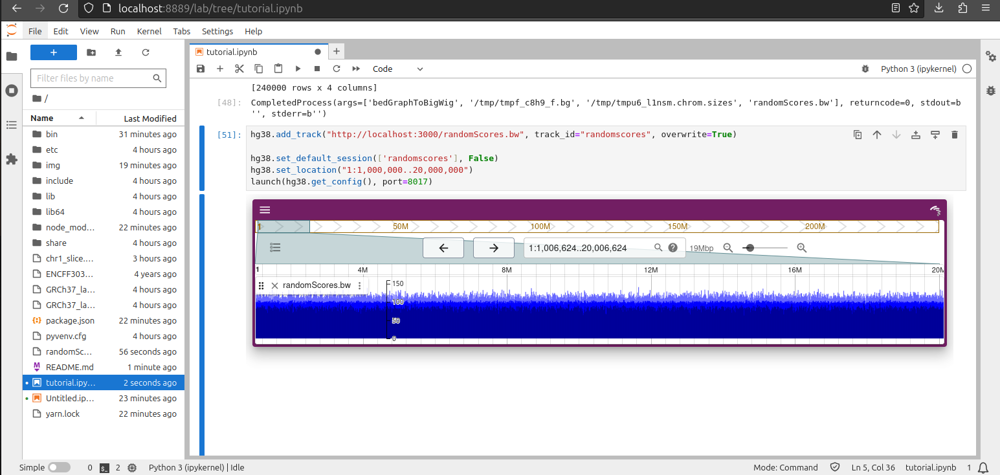

# jbrowse-jupyter tutorial - locally with JupyterLab

## Introduction

jbrowse-jupyter is a method for running JBrowse 2 in a Jupyter notebook. In this
tutorial, we will look at how to use it inside JupyterLab (run locally on your
computer), and to load a dynamically generated bigwig track.

## Pre-requisites

- Python/pip installed
- Terminal
- Nodejs installed (used to launch a temporary HTTP server)
- bedGraphToBigWig in your PATH (download
  https://hgdownload.cse.ucsc.edu/admin/exe/linux.x86_64/)

## Step 1. Create a python virtual env

This is common for most python workflows these days: a virtual env let's you
install python packages locally to a folder rather than to your system

```bash
mkdir project
cd project
python3 -m venv .
source bin/activate
```

Now when you run pip, it is aliased to "bin/pip" that installs locally. Re-run
`source bin/activate` whenever you are revisiting this project folder

## Step 2. Install and launch Jupyter Lab

I run the following commands in the `project` folder in the terminal

```bash
pip install jupyterlab
jupyter lab
```

A new browser window will be launched as a result

Then launch a new notebook



## Step 3. Install jbrowse-jupyter in the notebook

In one cell do

```
!pip install jbrowse-jupyter
```

And then in the next cell do

```python
from jbrowse_jupyter import launch, create

## basic hg38 linear genome view pre-loaded by selected genome='hg38'
hg38 = create('LGV', genome='hg38')

## random location
hg38.set_location("10:1000..35000")

## launch the server, specify an arbitrary port (this is a dash thing to use a port)
launch(hg38.get_config(), port=3013)
```

This will then open the LGV on hg38 with a given location. Note: you could
`pip install jbrowse-jupyter` on the command line instead of in a notebook cell
if you wanted to.

## Step 4. Launch a local HTTP server

Local files require JBrowse to access files over HTTP. One method of doing this
is starting up an HTTP server. The current jbrowse-jupyter docs refer to
something called the jupyter_proxy_server. I was unable to get this to work. A
simple alternative, is to launch a server manually.

In the `project` folder, in a new terminal tab or instance, you can run

```bash
npx serve . --cors
```

This launches a HTTP server in the `project` folder and allows CORS (allows
cross-origin, in this case, requests from a different port, to access the
files).

The `npx serve` command will start on port 3000 by default, or will print out
the port it is using if 3000 is occupied. Take note of this port.

## Step 5. Download files to your local HTTP server, and add as

In the `project` folder, in yet another terminal tab or instance, run

```bash
wget https://www.encodeproject.org/files/ENCFF303QSJ/@@download/ENCFF303QSJ.bigWig
```

This downloads the simple bigWig file (242Mb) from the ENCODE web server. Then
open up the Jupyter Lab in the browser, and add a new cell.

Enter:

```python
## reference the file, being served by our above npx serve command
hg38.add_track("http://localhost:3000/ENCFF303QSJ.bigWig", track_id="mybigwig", overwrite=True)

## open up the track by default by making it part of the default session
hg38.set_default_session(['mybigwig'], False)

## interesting region
hg38.set_location("10:27,369,085..27,494,654")

## important: different port than the first cell, otherwise you get an error.
launch(hg38.get_config(), port=8003)
```

## Step 6. Dynamically create a bigwig in python, write to file on disk

Install pandas and bioframe

In a notebook cell run

```
!pip install pandas
!pip install bioframe
```

In another notebook cell run

```python
import pandas as pd
import bioframe
import random
import numpy as np

## generate some random poisson distributed data on 'chr1' only, as a data frame
def makedf(n,windowSize):
    chroms = ["chr1"] * n
    starts = range(0, n * 10, windowSize)
    ends = [x + windowSize for x in starts]
    scores = np.random.poisson(100, n)

    df = pd.DataFrame({
        'chrom': chroms,
        'start': starts,
        'end': ends,
        'score': scores
    })

    return df

## write the data frame to a bigwig file
df=makedf(24_000_000,1000)
chromsizes = bioframe.fetch_chromsizes('hg38')
bioframe.to_bigwig(df,chromsizes,"randomScores.bw")
```

The final step uses bioframe to write out the result to a bigwig file on disk,
in the `project` folder. This step invokes `bedGraphToBigWig` so make sure that
is in your $PATH (https://hgdownload.cse.ucsc.edu/admin/exe/linux.x86_64/)

## Step 7. Add our new BigWig file as a track, and re-launch the instance

In a new notebook cell

```python
hg38.add_track("http://localhost:3000/randomScores.bw", track_id="randomscores", overwrite=True)

hg38.set_default_session(['randomscores'], False)
hg38.set_location("1:1,000,000..20,000,000")
launch(hg38.get_config(), port=8005)
```

This produces a new instance with our random values from data frame



The data at this zoom level (showing millions of bp) is summarized so light blue
is max in the window, dark blue is min in the window, and normal blue is mean.
This can help identify peaks, or troughs.

## Result

The tutorial.ipynb contains the results of running this script

## Credit

Big thanks to [@carolinebridge-oicr](https://github.com/carolinebridge-oicr) for
code samples, bug fixing, and investigation!

## Versions

We published updated jbrowse-jupyter and dash_jbrowse packages to aid the
processes in this article

## Footnote

This assumes running jupyter lab locally. There are other ways that jupyter
notebooks are run, we will try to make separate tutorials to address these! You
can try to adapt this tutorial if you would like.

However, this tutorial specifically is geared towards running on your local
machine (as opposed to e.g. Google CoLab cloud) so that we can launch the HTTP
server with `npx serve`. Note that you can use your own HTTP server of choice
instead of `npx serve` if it's convenient.
